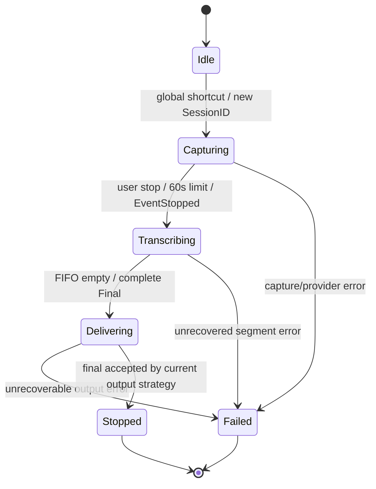
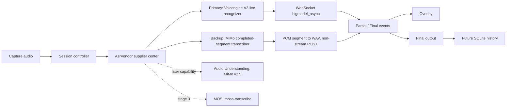

# VoxInk 架构

## 模块边界

| 模块 | 责任 | 当前状态 |
| --- | --- | --- |
| Capture | malgo/WASAPI 麦克风音频、Win32 全局快捷键与电平 | 未实现；阶段 1 采用目标 |
| Session controller | 状态机、`SessionID`、事件门控 | 仅稳定类型骨架 |
| `AsrVendor` 供应商中心 | 未来统一承载供应商配置、能力声明与引擎选择；模型属于供应商配置 | 实现目标；当前仅有稳定 Provider 类型骨架 |
| ASR adapters | 火山 live recognizer、MiMo completed-segment transcriber；MOSI 延后 | 未实现 |
| Overlay/UI | 原生 Win32 popup + GDI、no-activate；显示 `Partial`、`Final`、错误和电平 | 未实现；阶段 1 采用目标 |
| Output | SendInput、剪贴板粘贴、仅复制及降级 | 未实现 |
| History/settings | SQLite 历史、偏好与凭据引用 | 未实现 |

## 状态机

正常路径固定为 `Idle → Capturing → Transcribing → Delivering → Stopped`。录音期间，batch 路径可识别已封段音频，火山 live 路径则持续发送音频帧；两者产生的增量都只作为 `Partial` 或稳定片段累积，会话总体保持 `Capturing`。用户停止或达到 60 秒上限时，控制器结束捕获并以代码事件 `EventStopped` 明确表示捕获已停止；这不表示识别完成。火山路径还必须发送末包并等待协议终态，且 `definite=true` 只表示稳定分句，不是 Session `Final`。随后 `Transcribing` 等待协议终态或 batch FIFO 排空、按顺序形成唯一完整 `Final`，再推进到 `Delivering`。`Delivering` 在阶段 1 仅把完整 `Final` 交给悬浮层展示（overlay-only），不执行 Windows 文本注入、`Clipboard Paste` 或 `Copy Only`；阶段 2 才加入实际输出与安全降级。

`Stopped` 仅表示正常结束；`Capturing`、`Transcribing` 或 `Delivering` 中的错误进入终态 `Failed`，不再转到 `Stopped`。控制器清理终态会话资源后，可在下一次输入时以新的 `SessionID` 从 `Idle` 启动；这不是旧会话从 `Failed` 转到 `Idle` 或 `Stopped`。UI-facing 事件采用 `Partial`、`Final`、`Stopped`、`Error` 与 `Level`，其中 `Stopped` 明确对应代码中的 `EventStopped`。

## SessionID 与迟到事件门控

每次快捷键启动都会生成一个新的 `SessionID`。控制器仅接收同时满足下列条件的 Provider/UI 事件：

1. 事件的 `SessionID` 等于当前活动会话；
2. 事件类型符合当前状态的允许转换；
3. 该会话尚未终结或被替换。

其余事件应被丢弃并可记录脱敏诊断。这样，网络延迟导致的旧 `Partial`、旧 `Final` 或旧错误不会覆盖下一次输入。

## `AsrVendor` 供应商中心与能力分层

- **供应商中心实现目标：** 阶段 1 固定火山 V3 `bigmodel_async` 为主、MiMo `mimo-v2.5-asr` 为备用；二者不并行双发。主失败后，备用接收同一完整内存 PCM 段并在转 WAV 后非流式提交；均失败必须产生明确 `Error`。
- **网络契约：** live recognizer 管理连接、音频帧、末包与协议终态；completed-segment transcriber 接受完整音频并返回单段结果。火山不能伪装成现有 batch `SegmentTranscriber`，两类实现只共享 session、错误和事件边界。
- **Streaming ASR** 接收捕获尚未完成时的音频；火山 `definite` 是稳定分句信息，只有捕获停止、末包已发且协议终态到达后才能形成唯一完整 `Final`。
- **File/Batch ASR** 接受完整段音频；阶段 1 仅 MiMo `mimo-v2.5-asr` 作为备用。MOSI `moss-transcribe` 延后阶段 3，异步查询 endpoint 在账户核验前保持未确认。
- **Audio Understanding** 处理音频语义理解。`mimo-v2.5` 保持独立能力，不作为默认 ASR，也不宣称与专用模型等价。
- `AsrEngineModeResolver` 一类的模式解析只负责依据供应商能力和模型配置选择执行路径，不把 Streaming、File/Batch 与 Audio Understanding 强行包装成同一种协议请求。

当前代码仍保留实现无关的 Provider、recognition-mode、Session 和事件领域类型；供应商中心是未来迁移边界，不表示 registry、引擎或主备策略已经实现。

## Windows 阶段 1 线程与数据边界

- 音频采用 `github.com/gen2brain/malgo v0.11.25` 并显式选择 WASAPI，callback 输出固定为 16 kHz、单声道、PCM16。
- audio callback 只把借用 PCM 复制到有界 ingress 并计算 level；不切段、不发网络请求、不更新 UI，也不执行设备停止/释放。
- session owner 串行管理 controller、分段、Provider 生命周期和事件发布；UI 线程只处理 `RegisterHotKey`/`WM_HOTKEY`、GDI 绘制及投递的状态更新。
- 全局热键直接使用 `RegisterHotKey` + `MOD_NOREPEAT`；overlay 使用原生 Win32 popup + GDI，并以 no-activate/topmost 行为避免抢焦点。
- Win32 绑定采用 `golang.org/x/sys v0.47.0`。阶段 1 不采用 go-wca、hotkey wrapper、Fyne 或 Wails/WebView，也不包含托盘、文本输出、SQLite 或 TSF。

以上是 v0.4 的未实现采用目标；必须按 Windows 实机顺序 `audio only → hotkey+overlay → 60s/session → session events → real ASR` 验证。外部证据见记忆 `#352`（2026-08-01）及[Windows API](research/windows-apis.md)、[Go 生态](research/go-ecosystem.md)研究记录。

## 会话音频、切段与顺序拼接

- 单次会话最长 60 秒；原始 PCM 只存在会话内存，处理完成后释放，默认不落盘。
- 非流式/文件路径采用停顿渐进切段：最短有效语音 500ms、连续静音 600ms、无停顿最大段长 15 秒。停顿时在静音区间中点切段且录音继续；用户停止或达到 60 秒上限时冲刷尾段。
- 500ms 仅限制普通自动封段。用户停止或硬上限产生的非空短尾即使不足 500ms 也提交。
- 音频段进入唯一 FIFO，按顺序识别和拼接；同一会话不并行识别多个段。中文直接拼接，ASCII 字母/数字边界按需要补空格。停止录音后仍须等待队列排空，才产生完整 `Final`。

模型分类与真实/结果流边界的证据见[Provider 研究记录](research/providers/mimo.md)、[火山 V3](research/providers/volcengine.md)和[MOSI](research/providers/mosi.md)。

## 输出策略与数据流

`Final` 先进入输出安全检查，再选择配置策略：优先 `SendInput`、其次 `Clipboard Paste`，或用户显式选 `Copy Only`。焦点变化、目标不允许注入或无法验证目标时，强制降级 `Copy Only`。partial 默认只在悬浮层显示；仅当 Provider 对严格稳定前缀作出可用保证时，才可选择稳定增量输入，绝不使用退格重写作为默认实现。

未来历史只接收最终文本和最小元数据；原始音频不在默认数据流中留存。
