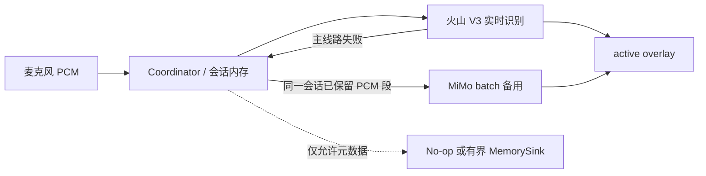

# 阶段 1 隐私告知与脱敏诊断

本文定义阶段 1 的音频外发、内存生命周期、用户告知和最小诊断边界。实现仅提供结构化内存诊断，不包含磁盘日志、远程遥测、历史库、同意数据库或完整日志框架。

## 数据流与外发范围

- 阶段 1 主线路在收音期间把麦克风音频发送至火山 V3 实时识别；默认不并行发送给备用供应商。
- 主线路失败时，Coordinator 才把同一会话内存中已保留的 PCM 段及后续完整段交给 MiMo；MiMo 请求所需 WAV/Base64 只作为请求期内存数据，不写入诊断或磁盘。
- Provider 返回的 partial/final 正文只进入会话状态和 overlay，不进入诊断。
- Coordinator 是应用层诊断事件的唯一生产 owner。capture callback、Provider worker 和回调只发送消息或错误信号，不直接写诊断。

## 诊断允许字段

`internal/diagnostic.Event` 的有效值经校验构造，并且字段不可由调用方直接改写。允许字段如下：

| 字段 | 允许值与边界 |
| --- | --- |
| `SessionID` | 当前会话安全 token；仅 ASCII 字母、数字、`.`、`_`、`-`，最长 64 字节 |
| `Kind` | `session_started`、`capture_stopped`、`live_fallback`、`session_completed`、`session_failed`、`capture_fault` 对应的固定枚举 |
| `Stage` | `session`、`capture`、`live`、`batch`、`delivery` 对应的固定枚举 |
| `AsrVendor` | 可空；非空时只能是内置固定供应商标识，例如 `volcengine`、`mimo`、`mosi` |
| `Code` | 可空；只能取实现内固定 allowlist 的安全 token，仅 ASCII 字母、数字、`.`、`_`、`-`，最长 32 字节；不得来自 `err.Error()` |
| `Count` | 事件相关非正文计数；当前为会话已接受 PCM 字节数 |
| `DurationMS` | 由已接受固定格式 PCM 字节数推导的毫秒数 |

阶段 1 固定 code 包括用户停止、60 秒上限、live 建连/worker/队列失败、capture overflow/内部错误/启停错误、无效 PCM、切段错误、batch 失败/队列边界和状态拒绝。构造器拒绝 allowlist 外的 code；新增 code 必须继续满足固定语义与 token 边界，不能把供应商正文转换成“动态 code”。

## 诊断禁止字段

诊断 Event、测试证据和关闭 Issue 的输出均不得包含：

- 识别 partial/final、完整服务端错误正文或任意自由文本 payload；
- 原始 error message 或 `err.Error()`；
- API key、resource ID、Authorization/api-key header、请求 ID 等凭据或认证材料；
- endpoint、endpoint query、请求/响应 body 或供应商协议包；
- PCM、WAV、Base64、音频 URL 或可还原音频的字节；
- 用户本地环境变量值、credentials 文件内容或真实账户数据。

## 容量与生命周期

- `app.Options.DiagnosticSink` 为可选注入点；`nil` 固定使用 No-op，不要求生产入口保存诊断。
- `MemorySink` 创建时必须给出正容量。达到容量后覆盖最旧事件，并在同一锁保护下累计 `Overwritten`；快照按从旧到新返回，容量不会增长。
- 诊断只驻留进程内存，不落盘、不上传；进程结束或 sink 不再被引用后消失。
- 原始 PCM 默认只在当前会话、capture 有界 ingress、live/batch 有界队列和请求构造期间驻留内存。正常完成、失败或关闭时，Coordinator 取消 worker、关闭 Provider，并释放 segmenter、保留段和队列引用。
- “释放”表示应用不再保留这些 Go 引用，由 Go 运行时回收；阶段 1 不宣称完成物理内存安全擦除。默认不创建音频文件。

预期事件顺序示例：

- live 成功：`session_started → capture_stopped → session_completed`；
- live 失败后备用成功：`session_started → live_fallback → capture_stopped → session_completed`；
- capture 或识别失败：在已发生事件后记录 `capture_fault`（若适用）与 `session_failed`，不记录原始错误。

## 用户可见告知

Listening 和 Transcribing 的 active overlay 固定显示以下中文 Notice，并按 rune 数限制长度；Idle 和 Error 不显示 Notice，窗口保持 no-activate，不新增弹窗、设置页或同意存储：

> 隐私提示：麦克风音频会发送至火山进行实时识别；主线路失败时，同一会话音频可能发送至 MiMo。原始音频默认仅驻留内存且不保存；供应商数据政策请以账户及当期条款为准。

## 供应商未确认边界

本地实现只能保证 VoxInk 默认不把原始音频写入本地磁盘或诊断。火山、MiMo 账户侧的数据留存、训练使用、处理地域、删除机制、合同承诺和当期政策均未由本实现保证；真实账户接入和发布前必须按账户配置及当期官方条款复核，并以脱敏证据记录结论。

## 验证与关闭证据清单

- `go test ./...`、`go test -race ./...`、`go vet ./...`；
- `CGO_ENABLED=0 GOOS=windows go test ./...`、`CGO_ENABLED=0 GOOS=windows go build ./...`、`CGO_ENABLED=0 GOOS=windows go vet ./...`；
- MemorySink 容量、顺序、覆盖计数和并发测试通过；
- Event 构造器拒绝超长或非 token code、未知供应商和不安全 SessionID；
- Coordinator canary 测试覆盖 API key、Authorization、PCM/Base64、识别正文和 endpoint，快照不命中；
- live fallback、complete、fail、capture overflow 的事件顺序及 SessionID 已断言；
- cleanup 测试证明会话结束后 segmenter、保留段及 live/batch 队列引用被释放；
- active overlay Notice、Idle/Error 行为、Windows View rune 截断和 no-cgo 交叉构建已验证；
- 关闭证据只附命令结果、事件 enum/code 和脱敏快照摘要，不附真实 payload、环境值或本地敏感文件。
